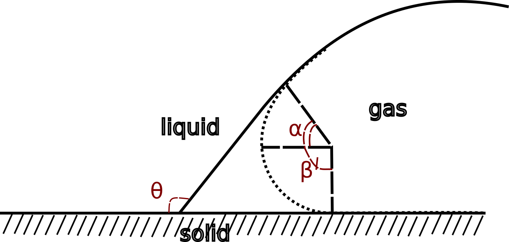

.. _model:

How we get the contact angle
===============================

To get the contact angle from labelized binarized images, we will leverage Gauss-Bonnet theorems
on a surface mesh approximation of the two-phases transition.

Gauss-Bonnet theorem claims that surface and boundaries sum of respectively the Gaussian, :math:`\kappa_G`, and average
curvature, :math:`\kappa_m`, is conserved and proportional to the surface's Euler characteristic :math:`\chi(\Omega)`.

.. math::

    \int_{\Omega} \kappa_G d\Omega + \int_{\partial \Omega} \kappa_m d\Gamma = 2 \pi \chi(\Omega)

On the other hand, capturing from a binarized image, is accurate only to the definition of the image.
Another error comes from the building of the 3D surface technics. The overall process tends to approximate
surface smoother than they really are. A geometric construction allows to restore a better evaluation of
the three phase contact points along the three phase contact line

The dashed surface stands for the approximation of the thick *real* surface. Hence :math:`\alpha + \beta - \theta = 0`.
Reminding that a torus curvature parametrized by its main direction :math:`\nu`, interior radius :math:`r` and generative radius :math:`R`,

.. math::

    K_G = \frac{cos \nu}{r(R + r cos \nu)}

then assuming :math:`R>>r` and entreing the defect curvature into Gauss-Bonnet,

.. math::

    2 \pi n (1-cos \theta) = 2 \pi \chi - \int_{\Omega} \kappa_G d\Omega

Assuming that all processed 2D surfaces are closed and then boundless. As we have access to the whole ganglia, let's denote its 3D surface :math:'\zeta',
we can equivalently write:

.. math::

    2 \pi n (1-cos \theta) = \int_{\zeta} \kappa_G d\zeta - \int_{\Omega} \kappa_G d\Omega
