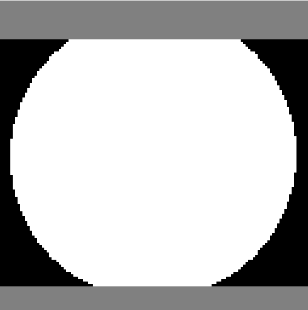

.. _tuto0:

How it is working on a simple 2 contacts / 2 angles case
======================================================================

To demonstrate the workflow a generator of label-ed image has been implemented in the `CImg <https://cimg.eu/>`_  interface.
It allows to generate 3d droplets that are intersected with :math:`n` surfaces. To do so, the simple case of a single droplet being
intersected by a horizontal surface is added :math:`n-1` times and rotate by the input angle. If it is forming :math:`n` loops, then
it can be processed and contact angles can be retrieved. If it forms less than :math:`n` loops, then some averaging is occurring on the
self-intersected loop.

The first command to generate labeled image is the following,

.. code:: bash

    /path/to/bin/ccpm --gen-drop size_in_px --test-angle list_of_angles --test-rot list_of_rotation

Then for a 128 pixels wide, length and height image with 26 and 36 degrees top and bottom, we should exectute

.. code:: bash

    /path/to/bin/ccpm --gen-drop 128 --test-angle 0.8,0.9 --test-rot 180

The resulting image in tiff, named automatically as `contactSphere128_0.900000_180.000000_0.800000_.tiff`

It can serve as input to the whole workflow. To imposed angles, their :math:`arccos(x)` values are used. Indeed, the :math:`0.8` and :math:`0.9`
values above stands for the values of :math:`\alpha` on the following scheme,

Which gives :math:`theta` upon an arccosine function.

Once generated, the workflow can be ran as explained in :ref:`command`,

.. code:: bash

    /path/to/bin/ccpm --image /path/to/generated.tiff -u 1,2,3 -o /path/to/output
    /path/to/bin/ccpm --image /path/to/output/isoVal_3_cc_1.tiff -n /path/to/output/isoVal_mapping.csv -x 5.1 -o /path/to/output

Such a log should be output,

 .. code-block:: text
   :emphasize-lines: 18-22

    Testing started at 3:47 PM ...
    2025-06-02 15:47:59.111 (   0.428s) [        14547600]             itf_CGAL.h:380   INFO| Using parameters:
         angle: 30
         radius: 4
         distance: 1
    2025-06-02 15:48:00.343 (   1.660s) [        14547600]             itf_CGAL.h:223   INFO| 	 [completed]
    2025-06-02 15:48:00.374 (   1.691s) [        14547600]             itf_CGAL.h:227   INFO|  Final number of points: 2028
    2025-06-02 15:48:00.397 (   1.714s) [        14547600]             itf_CGAL.h:316   INFO| Mesh Info : number of vertices 2028
    2025-06-02 15:48:00.397 (   1.714s) [        14547600]             itf_CGAL.h:317   INFO| Mesh Info : number of edges 6078
    2025-06-02 15:48:00.397 (   1.714s) [        14547600]             itf_CGAL.h:318   INFO| Mesh Info : number of half-edges 12156
    2025-06-02 15:48:00.397 (   1.714s) [        14547600]             itf_CGAL.h:319   INFO| Mesh Info : number of faces 4052
    2025-06-02 15:48:00.407 (   1.724s) [        14547600]             itf_CGAL.h:660   INFO| 0 sharp edges
    2025-06-02 15:48:32.441 (  33.758s) [        14547600]             itf_CGAL.h:624   INFO|  Processing curvature
    2025-06-02 15:48:32.569 (  33.886s) [        14547600]             itf_CGAL.h:600   INFO| Building neighboring tree
    2025-06-02 15:48:32.574 (  33.891s) [        14547600]             itf_CGAL.h:265   INFO| integral_constant :: 12.5409
    2025-06-02 15:48:32.574 (  33.891s) [        14547600]             itf_CGAL.h:267   INFO|  angle :: label, numel, euler
     [iv, area]
    2025-06-02 15:48:33.479 (  34.796s) [        14547600]             itf_CGAL.h:431   INFO|  number of CC : 2
    2025-06-02 15:48:34.923 (  36.240s) [        14547600]             itf_CGAL.h:594   INFO| [1.35337,2515.04]
    2025-06-02 15:48:34.923 (  36.240s) [        14547600]             itf_CGAL.h:281   INFO| 2, 221,-2, 38.6887
    2025-06-02 15:48:34.925 (  36.242s) [        14547600]             itf_CGAL.h:594   INFO| [0.775918,1848.96]
    2025-06-02 15:48:34.925 (  36.242s) [        14547600]             itf_CGAL.h:281   INFO| 1, 180,-1, 29.2544
    2025-06-02 15:48:35.093 (  36.410s) [        14547600]             itf_CGAL.h:305   INFO| Final number of points: 2028

In order to visualize, one can leverage the produced `isoVal_3_cc_1.stl` and the `TableToPointData` filter in Paraview reading the `isoVal_3_cc_ncsvfile_m.csv` where `n` is
the label of the component treated and `m` the connected component of triple line.